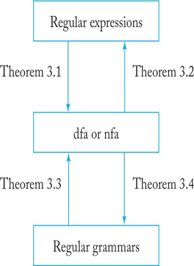

# Context Free Languages

## Recap

## Context Free Grammers

The productions in a regular grammar are restricted in two ways: The left side must be a single variable, while the right side has a special form. To create grammars that are more powerful, we must relax some of these restrictions. By retaining the restriction on the left side, but permitting anything on the right, we get context-free grammars.

DEFINITION 5.1
A grammar G = (V, T, S, P) is said to be context-free if all productions
in P have the form
A → x,
where A ∈ V and x ∈ (V ∪ T)*.
A language L is said to be context-free if and only if there is a
context-free grammar G such that L = L (G).

## Derivations

Example derivation:
> S ⇒ aSa ⇒ aaSaa ⇒ aabSbaa ⇒ aabbaa

Make a rightmost derivation for "abbbb"
S ⇒ aAB
A ⇒ bBb
B ⇒ A|λ

You can use a tree to solve this problem instead of using arrows. Regarldess of if you 

## Ambiguity

A grammar is ambiguous if there is more than one parse tree for some string in the language. Ambiguity is a property of the grammar, not the language. If a language has an ambiguous grammar, it is said to be inherently ambiguous.

Solvgin ambiguity:
- Associate orecedence rules with operators
    - Is outside the grammar
- Rewrite your grammer